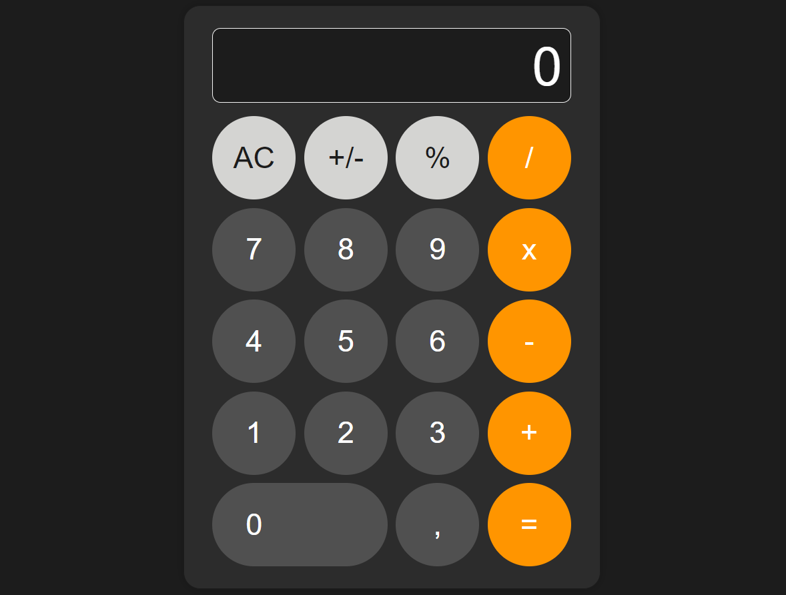

# A Web Replica of an iOS Calculator

## Overview

The most unique and unimaginable project, the holy grail of a CS student - The Calculator. Built with HTML, CSS, and vanilla JavaScript.



## Things I Learned/Improved On:

- Basics of the CSS Grid property
- Working with strings and floating-point numbers in JS
- Basics of JS event handling
- Manipulating the DOM through JS

## Future Plans

I'll leave this project here to revisit later and see the progress I've made over time.

## Getting Started

To view and interact with the calculator, clone this repository and, open `index.html` in your web browser.

```sh
git clone https://github.com/vasile-draguta/IOS-Calculator-Replica.git
cd IOS-Calculator-Replica
open index.html
```
